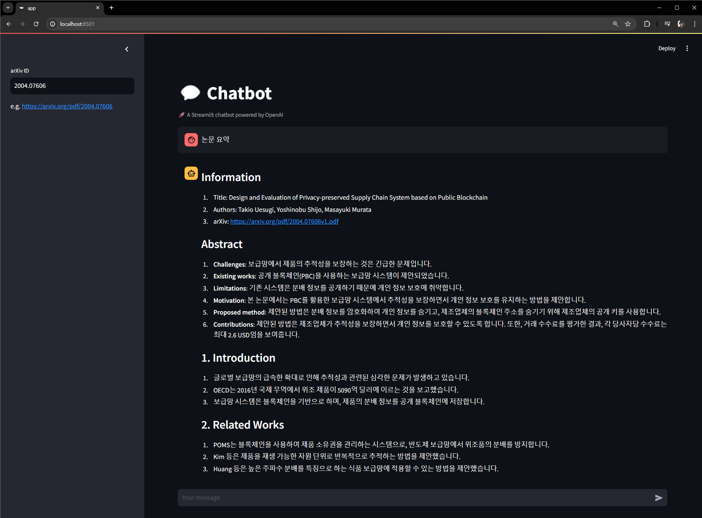

# Paper-Chat

질의하고 싶은 논문의 arXiv ID를 이용하여 대화가 가능한 논문 기반 챗봇입니다.



# Usage

1. Docker-compose를 통해 cluster(entrypoint, elasticsearch)를 구축하고 streamlit을 실행

```bash
 docker-compose up
```

2. Streamlit app 접속

```bash
http://localhost:8501
```

# Description

1. 논문의 ID(arXiv ID)를 sidebar에 입력하면, 해당 논문의 요약이 출력됨.
   - DONE: Elasticsearch에 지금까지 검색한 논문의 정보들을 저장, 캐싱하여 가져옴
   - TODO: 논문의 ID는 현재 고정되어 있는데, 변경할 수 있도록 해야함.
2. 이후 해당 논문에 대한 질의 가능.
   - TODO: Hallucination이 있거나, 제대로 대답을 못하는 경우가 종종 있음
3. 다른 논문에 대하여 질의를 하고 싶은 경우, sidebar에 새로운 논문의 ID를 입력
   - TODO: 기능 구현
4. 이후 해당 논문에 대한 질의 가능.
   - TODO: 기능 구현

# TODO

1. 주어진 keyword와 관련있는 논문들을 알려주는 기능을 추가
2. 기타 TODO 해결
