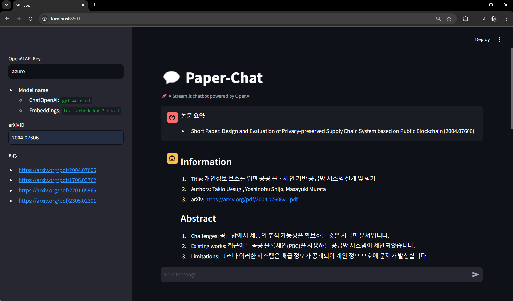

# Paper-Chat

질의하고 싶은 논문의 arXiv ID를 이용하여 대화가 가능한 논문 기반 챗봇입니다.



# Usage

1. Docker-compose를 통해 cluster(entrypoint, elasticsearch)를 구축하고 streamlit을 실행

```bash
 docker-compose up
```

2. Streamlit app 접속

```bash
http://localhost:8501
```

# Description

1. 논문의 ID(arXiv ID)를 sidebar에 입력하면, 해당 논문의 요약이 출력됨.
   - DONE: Elasticsearch에 지금까지 검색한 논문의 정보들을 저장, 캐싱하여 가져옴
   - DONE: 논문의 ID는 현재 고정되어 있는데, 변경할 수 있도록 해야함.
2. 이후 해당 논문에 대한 질의 가능.
   - TODO: Hallucination이 있거나, 제대로 대답을 못하는 경우가 종종 있음
3. 다른 논문에 대하여 질의를 하고 싶은 경우, sidebar에 새로운 논문의 ID를 입력
   - DONE: 기능 구현
4. 이후 해당 논문에 대한 질의 가능.
   - DONE: 기능 구현

# TODO

1. 주어진 keyword와 관련있는 논문들을 알려주는 기능을 추가
2. AzureOpenAI 대신 일반 OpenAI token을 받으면 해당 LLM을 사용할 수 있도록 추가
3. 기타 TODO 해결
4. ElasticsearchManager Singleton class로 만들기

# .env

```
AZURE_OPENAI_ENDPOINT=...
AZURE_OPENAI_API_KEY=...
OPENAI_API_VERSION=...

AZURE_OPENAI_LLM_DEPLOYMENT_NAME=...
AZURE_OPENAI_LLM_MODEL=...

AZURE_OPENAI_EMBEDDINGS_DEPLOYMENT=...
AZURE_OPENAI_EMBEDDINGS_MODEL=...

# Password for the 'elastic' user (at least 6 characters)
ELASTIC_PASSWORD=...

# Password for the 'kibana_system' user (at least 6 characters)
KIBANA_PASSWORD=...

# Version of Elastic products
STACK_VERSION=8.14.3

# Set the cluster name
CLUSTER_NAME=docker-cluster

# Set to 'basic' or 'trial' to automatically start the 30-day trial
LICENSE=basic
#LICENSE=trial

# Port to expose Elasticsearch HTTP API to the host
ES_PORT=9200
#ES_PORT=127.0.0.1:9200

# Port to expose Kibana to the host
KIBANA_PORT=5601
#KIBANA_PORT=80

# Increase or decrease based on the available host memory (in bytes)
MEM_LIMIT=1073741824

# Project namespace (defaults to the current folder name if not set)
#COMPOSE_PROJECT_NAME=paper_chat
```
