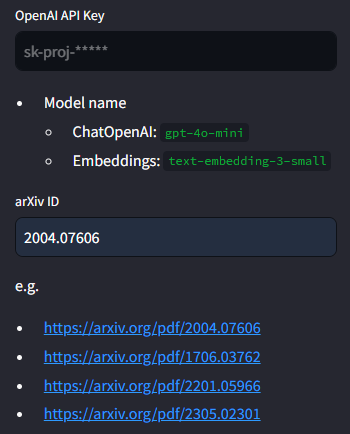

# Paper-Chat

**Paper-Chat**은 arXiv ID를 이용하여 학술 논문에 대하여 대화할 수 있는 AI 챗봇입니다. \
연구자, 학생들의 빠른 학습, 효율적인 실전 적용과 트렌드 분석 등을 위해 설계되었으며 복잡한 학술 내용을 쉽게 이해하고 탐색할 수 있도록 도와줄 수 있습니다.


# 사전 요구사항

1. Docker, Docker Compose가 설치되어 있어야 합니다.
2. `.env` 파일에 필요한 환경변수가 설정되어 있어야 합니다.

   ```bash
   # Needed if using Azure LLM
   AZURE_OPENAI_ENDPOINT=...
   AZURE_OPENAI_API_KEY=...
   OPENAI_API_VERSION=...
   AZURE_OPENAI_LLM_DEPLOYMENT_NAME=...
   AZURE_OPENAI_LLM_MODEL=...
   AZURE_OPENAI_EMBEDDINGS_DEPLOYMENT=...
   AZURE_OPENAI_EMBEDDINGS_MODEL=...

   # Password for the 'elastic' user (at least 6 characters)
   ELASTIC_PASSWORD=...

   # Password for the 'kibana_system' user (at least 6 characters)
   KIBANA_PASSWORD=...

   # Version of Elastic products
   STACK_VERSION=8.14.3

   # Set the cluster name
   CLUSTER_NAME=docker-cluster

   # Set to 'basic' or 'trial' to automatically start the 30-day trial
   LICENSE=basic
   #LICENSE=trial

   # Port to expose Elasticsearch HTTP API to the host
   ES_PORT=9200
   #ES_PORT=127.0.0.1:9200

   # Port to expose Kibana to the host
   KIBANA_PORT=5601
   #KIBANA_PORT=80

   # Increase or decrease based on the available host memory (in bytes)
   MEM_LIMIT=1073741824

   # Project namespace (defaults to the current folder name if not set)
   #COMPOSE_PROJECT_NAME=paper_chat
   ```

# 설치 및 실행

1. Repository를 가져오기
   ```bash
   git clone https://github.com/alchemine/paper-chat.git
   cd paper-chat
   ```
2. Docker-compose를 통해 cluster(entrypoint, elasticsearch cluster)를 구축하고 Streamlit 앱을 실행

   ```bash
   docker-compose -f docker-compose.prd.yml up
   ```

3. 브라우저에서 Streamlit app에 접속
   ```bash
   http://localhost:8501
   ```

# 사용 방법

### 1. Sidebar에 OpenAI API Key와 논문의 arXiv ID를 입력합니다.



- 논문의 ID는 `2004.07606`과 같은 형식을 하고 있습니다.
- `https://arxiv.org/pdf/2004.07606` 혹은 `https://arxiv.org/abs/2004.07606` 등 ID를 식별할 수 있는 문자열을 입력받으면 ID가 자동으로 식별됩니다.

### 2. 논문 요약이 자동으로 생성되어 표시됩니다.


- 처음으로 논문에 대한 요약문을 생성하는 경우, 약 30초 정도의 시간이 소요됩니다.
- 이후부턴 기존에 생성된 요약문을 불러옵니다.

### 3. Chatbot 인터페이스를 통해 논문에 대하여 질문하면, 논문 내용을 기반으로 답변을 제공받을 수 있습니다.


- 탐색을 위해 사용된 쿼리(`Queries`)와 참고한 내용(`Contexts`)이 답변과 함께 출력됩니다.
- 해당 내용을 참고하여 Hallucination이 발생하였는지 확인해보세요.

### 4. 다른 논문에 대하여 질문하고 싶다면, sidebar에 새로운 arXiv ID를 입력하세요.


# 추가 기능 및 기능 개선

주요 개발 진행 상황은 [Issues](https://github.com/alchemine/paper-chat/issues)를 참고해주세요.
