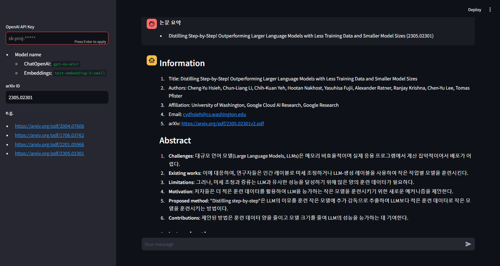
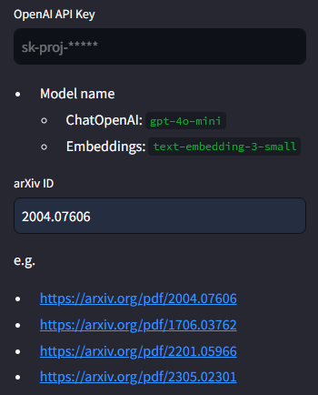
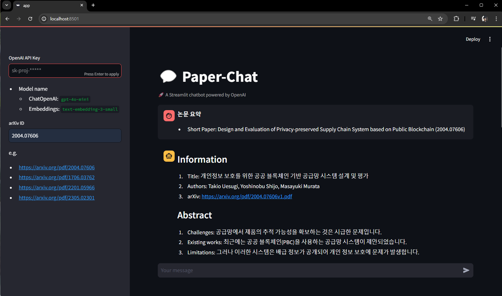
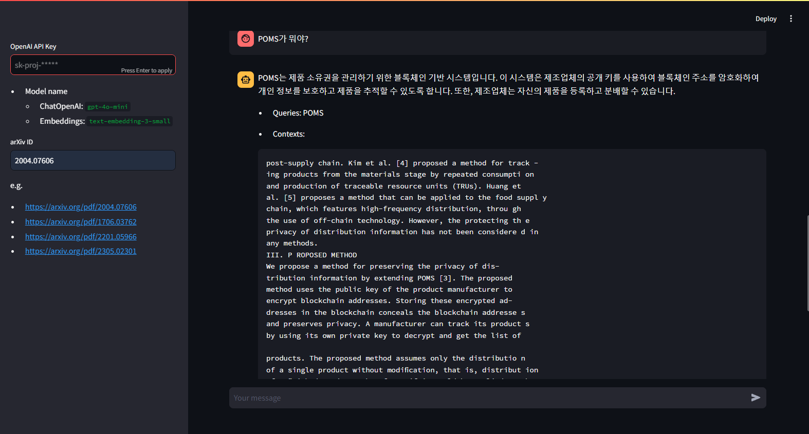

# Paper-Chat

**Paper-Chat** is an AI chatbot that enables conversations about academic papers using arXiv IDs. \
It is designed to assist researchers and students in quick learning, efficient practical application, and trend analysis, helping them easily understand and explore complex academic content.



# Prerequisites

1. Docker and Docker Compose must be installed.
2. Required environment variables must be set in the `.env` file.

   ```bash
   # Needed if using Azure LLM
   AZURE_OPENAI_ENDPOINT=...
   AZURE_OPENAI_API_KEY=...
   OPENAI_API_VERSION=...
   AZURE_OPENAI_LLM_DEPLOYMENT_NAME=...
   AZURE_OPENAI_LLM_MODEL=...
   AZURE_OPENAI_EMBEDDINGS_DEPLOYMENT=...
   AZURE_OPENAI_EMBEDDINGS_MODEL=...

   # Password for the 'elastic' user (at least 6 characters)
   ELASTIC_PASSWORD=...

   # Password for the 'kibana_system' user (at least 6 characters)
   KIBANA_PASSWORD=...

   # Version of Elastic products
   STACK_VERSION=8.14.3

   # Set the cluster name
   CLUSTER_NAME=docker-cluster

   # Set to 'basic' or 'trial' to automatically start the 30-day trial
   LICENSE=basic
   #LICENSE=trial

   # Port to expose Elasticsearch HTTP API to the host
   ES_PORT=9200
   #ES_PORT=127.0.0.1:9200

   # Port to expose Kibana to the host
   KIBANA_PORT=5601
   #KIBANA_PORT=80

   # Increase or decrease based on the available host memory (in bytes)
   MEM_LIMIT=1073741824

   # Project namespace (defaults to the current folder name if not set)
   #COMPOSE_PROJECT_NAME=paper_chat
   ```

# Installation and Execution

1. Clone the repository

   ```bash
   git clone https://github.com/alchemine/paper-chat.git
   cd paper-chat
   ```

2. Build the cluster (entrypoint, elasticsearch cluster) and run the Streamlit app using Docker Compose

   ```bash
   docker-compose up
   ```

3. Access the Streamlit app in your browser
   ```bash
   http://localhost:8501
   ```

# How to Use

### 1. Enter the OpenAI API Key and the arXiv ID of the paper in the sidebar.



- The paper ID is in the format like `2004.07606`.
- If you input a string that can identify the ID, such as `https://arxiv.org/pdf/2004.07606` or `https://arxiv.org/abs/2004.07606`, the ID will be automatically identified.

### 2. A summary of the paper is automatically generated and displayed.



- When generating a summary for a paper for the first time, it takes about 30 seconds.
- Subsequent requests will load the previously generated summary.

### 3. You can ask questions about the paper through the chatbot interface and receive answers based on the paper's content.



The queries used for exploration (Queries) and the referenced content (Contexts) are displayed along with the answer.
Check these to see if any hallucination has occurred.

### 4. If you want to ask questions about a different paper, enter a new arXiv ID in the sidebar.


# Additional Features and Improvements

Please refer to the [Issues](https://github.com/alchemine/paper-chat/issues) page for major development progress and updates.
